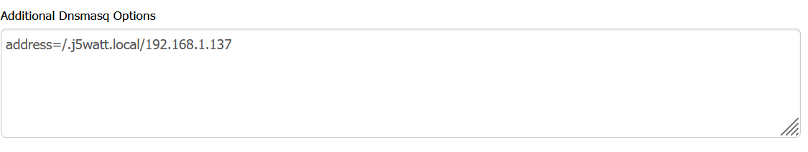

# docker-swarm 4 node raspberry pi cluster

### Install headless raspberry pi os
### Configure router
I have a linksys wrt3200acm router with dd-wrt.  Under services, give the raspberry pi's a static IP lease. [Your IP addresses will differ]

If you want your local network to point to the master node of the swarm.  [Your IP addresses will differ]

### Install ansible on the master node.  Need to be root [sudo su]
#### Install
apt update
apt install software-properties-common
apt-add-repository --yes --update ppa:ansible/ansible
apt install ansible

#### Generate and copy ssh keys from master/control node [rp1.local] in my case
mkdir -p ~/.ssh && chmod 700 ~/.ssh
ssh-keygen -t rsa
ssh-copy-id -i ~/.ssh/id_rsa.pub your_user@rp2.local
ssh-copy-id -i ~/.ssh/id_rsa.pub your_user@rp3.local
ssh-copy-id -i ~/.ssh/id_rsa.pub your_user@rp4.local

##### Build host file
nano /etc/ansible/host
Example content:
[control]
rp1.local ansible_connection=local

[workers]
your_user@rp2.local
your_user@rp3.local
your_user@rp4.local

[cube:children]
control
workers

##### Test ansbible
ansible cube -m ping